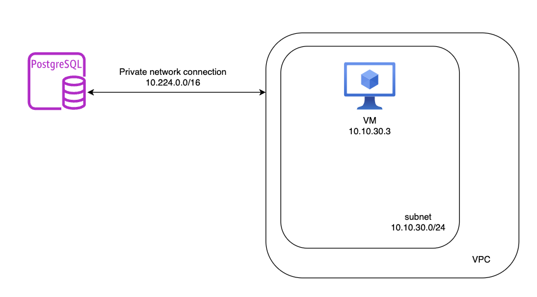
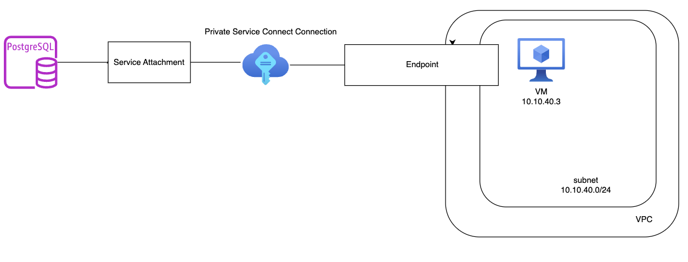

1. Connect SQL Instance through private services access



a. Create a VPC Network

```
module "vpc-sql-module" {
  source                  = "terraform-google-modules/network/google"
  version                 = "~> 7.0"
  project_id              = var.project_id
  network_name            = "vpc-sql-psa-network"
  auto_create_subnetworks = false
  mtu                     = 1460

  subnets = [
    {
      subnet_name   = "subnet-vpc-sql-psa"
      subnet_ip     = "10.10.30.0/24"
      subnet_region = var.region
    },
  ]
}
```

b. create a VM with the console due to 2fa \
c. create a SQL Instance with private ip configuration

You have to configure the private connection peering before creating the instance. 

First, allocate a IP-address for the PSA Connection. This will be automatically configured by google api.
```
resource "google_compute_global_address" "private_ip_address" {
  name          = "private-ip-address-sql-instance-psa"
  purpose       = "VPC_PEERING"
  address_type  = "INTERNAL"
  prefix_length = 16
  network       = module.vpc-sql-module.network_name
}
```
Second,configure the private services access connection.
```
resource "google_service_networking_connection" "default" {
  network                 = module.vpc-sql-module.network_name
  service                 = "servicenetworking.googleapis.com"
  reserved_peering_ranges = [google_compute_global_address.private_ip_address.name]
}
```
After all, create the SQL Instance
```
resource "google_sql_database_instance" "sql-instance-psa" {
  name             = "sql-instance-psa"
  region           = "europe-west4"
  database_version = "POSTGRES_14"

  depends_on = [google_service_networking_connection.default]

  settings {
    tier = "db-custom-2-7680"
    ip_configuration { 
      ipv4_enabled    = "false"
      private_network = "projects/${var.project_id}/global/networks/${module.vpc-sql-module.network_name}"
    }
  }
  deletion_protection = false
}

```

2. Connect SQL Instance through private services connect.



a. Create a VPC Network
```
module "vpc-sql-psc-module" {
  source                  = "terraform-google-modules/network/google"
  version                 = "~> 7.0"
  project_id              = var.project_id
  network_name            = "vpc-sql-psc-network"
  auto_create_subnetworks = false
  mtu                     = 1460

  subnets = [
    {
      subnet_name   = "subnet-vpc-sql-psc"
      subnet_ip     = "10.10.40.0/24"
      subnet_region = var.region
    },
  ]
}
```
b. create a VM with the console due to 2fa \
c. Create a SQL-instance with psc-enabled. No terraform, please use gcloud command.
```
    gcloud sql instances create sql-instance-psc \
    --project=cst-pbag-aiml-test \
    --region=europe-west4 \
    --enable-private-service-connect \
    --allowed-psc-projects=cst-pbag-aiml-test \
    --availability-type=regional \
    --no-assign-ip \
    --tier=db-custom-2-7680 \
    --database-version=POSTGRES_14

```

Make sure following flags are there \
 --enable-private-service-connect  
 --allowed-psc-projects

d. Create PSC Connection

Allocate an IP-Address for the PSC within the VPC Network created above

```
resource "google_compute_address" "psc_endpoint_ip" {
  address_type = "INTERNAL"
  name         = "private-ip-psc-sql-endpoint"
  purpose      = "GCE_ENDPOINT"
  region       = var.region
  subnetwork   = "subnet-vpc-sql-psc"
}
```

Create the PSC Endpoint with the ip from the VPC and service attachment from the SQL-Instance.
```
resource "google_compute_forwarding_rule" "psc-sql-endpoint" {
  ip_address = google_compute_address.psc_endpoint_ip.self_link
  name       = "psc-sql-endpoint"
  network    = module.vpc-sql-psc-module.network_name
  region     = var.region
  load_balancing_scheme = ""
  target     = var.service_attachment
}
```

The service attachment can be found at:
```
gcloud sql instances describe sql-instance-psc
```